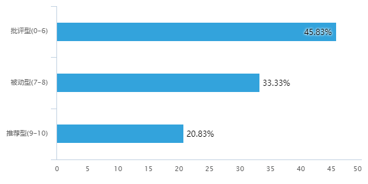
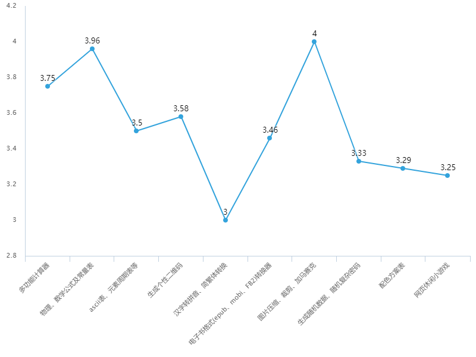

**小组成员**
|     |     |   |    |      |
|:---:|:---:|-  |:--:|:----:|
|CYH  |陈永桦|   |LH  |李浩  |
|HCH  |会川慧|   |YXR |余心如|
|     |     |   |    |      |

# 2017/11/24

## 1. LH：网页在线工具合集

用户可以定制属于自己的工具集（如计算器，简繁体转换，生成个性二维码），实现一些不常用但很有用的功能。
服务器将会保存每一位用户的设置，页面动态加载，方便用户使用。

**优点**

- 功能多元化，扩大了受众范围
- 功能模块多见于一些开源项目，可行性高

**缺点**：

- 功能模块很多，代码量大
- 许多功能针对特定人群，受众狭窄

## 2. CYH：宾馆、机票价格对比

不同的订房、订票软件的价格往往不同，网站能一键比较各类报价，为你提供最佳决策

**优点**

- 用户人群极大

**缺点**

- 技术难度大

## 3. YXR：用视频展示濒临消失的文化

**优点**

- 覆盖面大，有人文价值

**缺点**

- 受众有限
- 资料获取困难

## 4. **小组讨论**

主要针对工具集：

工具集合：
- 科学计算器 | 进制转换
- 公式 | 常量
- ascii | 元素周期表 | 大事年表
- 简体 <-> 繁体 | 汉字 -> 拼音
- 生成 二维码 | 条形码
- 小游戏
- 地图
- 配色方案
- 图片压缩、裁剪、马赛克
- 小说格式转换
- 小说阅读器
- 生成随机数据 | 随机密码
- 加密链接

可选插件：

- 历史的今天
- 天气

# 2017/11/28

## 1.工具集调研结果

## 2.CYH着手对比价工具的调研、YXR着手对备忘录的调研

# 2017/12/13 #

##成员 LH李浩，CYH陈永桦，HCH会川慧，YXR余心如##
##1.idea 确定及细化##
**首先确定了大方向为制作一个比价功能的网页或是APP，经过多方调查及讨论，定为以下三个方面：**

###**a.比较旅行住宿的价格**###
**经过讨论，该方案的调查人群显然并非学生人群，容易给调查带来麻烦，所以PASS**

###**b.比较电子用品的价格**###
**经过讨论，该方案依然不够具体，需要集中于某一件特定的电子产品，在难以取舍的情况下，讨论决定暂时将此方案按下**

###**c.比较书的价格**###
**经过讨论，该方案是三个方案中最具体也是比较符合实际需求的一个方案，讨论决定以此方案为执行方案，确定形式为做一个网页并展开进一步调查**

##2.问题细化##

**我们准备调查的问题：**

**1.我们的idea OK 吗？是否真的有一定的需求？**

**2.顾客希望做出什么功能，要比较哪些东西？**

**3.附加评价功能？月销量？运费？优惠策略，承诺？会员价？评价系统？二手书？**

**4.推荐排序功能？**

##3.调查汇总##

**本周周五及周日将展开更近一步的讨论及搞定分工问题。**

***END***

# 2017/12/15

## 1.会议内容

- 汇总调研结果
- 确定产品形态
- 明确小组分工

## 2.调研结果

### CYH

- 评价、运费、销量、优惠很重要

### LH

- 自建系统评价无用
- 页面逻辑结构见后面
- 排序算法，展示最好的三到四个

### YXR

- 店铺评价

### HCH

- 加入“最便宜”、“销量最多”等标签

## 3.产品形态及模块化

1. 搜索框
2. 首页推荐展示条目
3. 搜索结果展示条目
4. 商品展示页
5. 商品详情页
6. 用户评价信息条目

## 4.分工

计划于17号前完成组件的基本开发

- 余心如: 1, 2
- 陈永桦: 3 + 商品资源文件的编写
- 会川慧: 5
- 李浩: 4, 6
